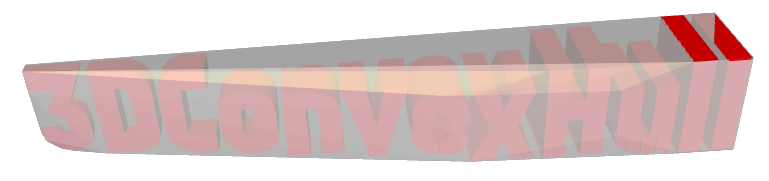

PostGIS Minimialist X3D Viewer 
================
The repo for this project is hosted at https://git.osgeo.org/gitea/robe/postgis_x3d_viewer.
This viewer is a viewer for viewing PostGIS http://postgis.net geometry queries utilizing PostGIS 2.0+,
 X3DOM http://www.x3dom.org/ (1.8.2)
, JQuery http://jquery.com (3.6.0), color picker JQuery plugin and a Web server that supports your language of choice (ASP.NET w. npgsql.net utilizing C# or VB.Net)
or PHP.  It is a loose wrapper around the PostGIS [ST_AsX3D](http://postgis.net/docs/ST_AsX3D.html) function  .

Requirements
--------------
 1. PostGIS 2.0+ (PostGIS 2.1+ with SFCGAL is preferred).  
    Note: if you are on windows, we do have http://postgis.net/windows_downloads that have SFCGAL https://gitlab.com/Oslandia/SFCGAL built-in. 
 2. A webserver supporting PHP or ASP.NET 2+.
 
Getting started
---------------
 1. Download the source for this.
 2. In your database that already has PostGIS installed, run the tox3d.sql script.
 3. If you are using ASP.Net, you'll need to get Npgsql.net driver 
    from http://npgsql.projects.pgfoundry.org/ and copy into the Bin folder

	If you are using PHP, make sure to have the PostgreSQL drivers enabled in your ini
 4. There are 3 server side query handler helper files GetX3D.php, GetX3DCS.ashx, GetX3D.ashx
    Depending on which one you want to use, edit the postgis_x3d_viewer.htm file and replace 
	``var postgis_handler = "GetX3D.php";``  
	 
	 with the one you want to use.
	
 5. Edit the config.inc.php (if using PHP) or the web.config (if using ASP.NET) filling in your database credentials
 6. Once you have made the changes you should be able to launch the postgis_x3d_viewer.htm on your web server and should be good to go.

Caveats
--------------- 
 1. The viewer handles only two types of queries -- Geometry which means the query results in a single geometry back
    or raw  which means the query returns a chunk of X3D that can be stuffed into a scene.
 2. There is very spotty support for 2D types since it is limited by what  ST_AsX3D
    which I have documented here: http://trac.osgeo.org/postgis/ticket/2838 and is sort of detailed in Manual
	http://postgis.net/docs/ST_AsX3D.html
	
Examples
----------
Refer to: http://www.bostongis.com/blog/index.php?/archives/229-PostGIS-Minimalist-X3D-Viewer-for-PHP-and-ASP.NET.html

Use Geometry for these examples
--------------------------------
```
SELECT ST_Translate(
 ST_Extrude(
   ST_Buffer(
  (SELECT 
    ST_Collect( ST_Rotate('LINESTRING(10 20, 30 40, 50 65)'::geometry, pi()*i/2
     , ST_Point(10, 20)) ) 
      FROM generate_series(0,2,2) As i ), 1), 0, 0, 2), 0, 0,6); 
```

```
SELECT ST_Extrude(ST_Buffer(ST_Union(
    ST_Point(10, 20), ST_Point(5, 5)), 10, 'quad_segs=48'),
     0, 0, 10);
```

```
SELECT ST_Translate(
   ST_Extrude(ST_Buffer(ST_Point(10, 20), 20, 'quad_segs=4'),
   0, 0, 2),0,0,10);
```

```
SELECT ST_Translate(ST_Extrude(ST_Buffer(ST_Point(10, 20), 3), 
  0, 0, 2),0,0,11);
```
  
  
Use Raw mode for these examples
--------------------------------
Note for Raw mode, you need to escape single quotes ' with two single quotes ''.
Also the selected color in the color picker is ignored and its up to you to include in your raw if needed.

Set of rainbow triangles
```
SELECT  '<Shape>
<IndexedTriangleSet index=''0 1 2 3 4 5 6 7 8'' solid=''false'' ccw=''true'' colorPerVertex=''true'' normalPerVertex=''true'' containerField=''geometry''>
<Coordinate point=''-4 1 3 -2 2 1.5 -3 4 0.5 -2 3 1.5 0 4 0 2 3 1.5 5 5 -2.5 4 3 1.5 6 4 2''/>
<Color color=''0 0.8 0 0 1 1 1 0 0 1 0.5 0 0.8 0 1 1 1 0 0.6 0.3 0.1 1 0 0.5 0 1 0.5''/>
</IndexedTriangleSet>
</Shape>';
```

A pyramid - to minimize on needing to escape single quotes you can use double quotes in X3D snippet
as shown here
```
SELECT  '<Shape>
        <IndexedFaceSet coordIndex="0 1 2 -1 1 3 2 -1 2 3 0 -1 3 1 0">
          <Coordinate point="0 0 0 10 0 0 5 0 8.3 5 8.3 2.8"/>
        </IndexedFaceSet>
        <Appearance>
          <Material diffuseColor="0.8 0.8 0.2" specularColor="0 0 0.5"/>
        </Appearance>
      </Shape>'
```

### These ones use ST_GeomFromWord 
You can get the function from [pramsey postgis_word.sql](https://gist.github.com/pramsey/2020ef463a8880edc7e23c56420d7df8). Use Raw mode for these.
This function is included in PostGIS 3.3+ and is called [ST_Letters](https://postgis.net/docs/manual-dev/ST_Letters.html)
```
SELECT string_agg('<Shape>' || ST_AsX3D(ST_Extrude(geom, 0,0, i*3)) || 
    '<Appearance>
          <Material diffuseColor="' || (0.02*i)::text || ' 0.8 0.2" specularColor="' || (0.05*i)::text || ' 0 0.5"/>
        </Appearance>
    </Shape>', '')
FROM (SELECT ROW_NUMBER() OVER() AS i, geom
      FROM ST_Subdivide(ST_GeomFromWord('PostGIS'),10) AS geom
      ) AS f;

```


Showing off [ST_3DConvexHull](https://postgis.net/docs/manual-dev/ST_3DConvexHull.html) introduced in PostGIS 3.3. The words overlaid with the 3d convex hull
```
WITH f AS (SELECT i, ST_Extrude(geom, 0,0, i ) AS geom
      FROM ST_Subdivide(ST_GeomFromWord('3DConvexHull'),5) WITH ORDINALITY AS sd(geom,i)
      ),
 combo AS (SELECT string_agg('<Shape>' || ST_AsX3D(f.geom) || 
    '<Appearance>
          <Material diffuseColor="1 0 0" specularColor="0.8 0 0.5"/>
        </Appearance>
    </Shape>', '') AS x3d
FROM f 
UNION ALL 
SELECT '<Shape>' || ST_AsX3D(ST_3DConvexHull(ST_Collect(f.geom) )) || '<Appearance>
          <Material specularColor="1 1 0" transparency="0.2"/>
        </Appearance></Shape>' AS x3d
FROM f
  )
SELECT '<Transform>' || string_agg(x3d, ' ') || '</Transform>'
FROM combo;
```


Support
------------
If you have questions comments or run into issues, please post to the ([postgis-users][]) mailing list or the github issue tracker for this project.


[postgis-site]:   http://postgis.net/
[postgis-users]:  http://lists.osgeo.org/mailman/listinfo/postgis-users